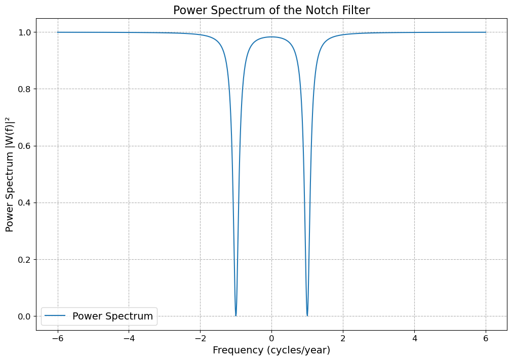
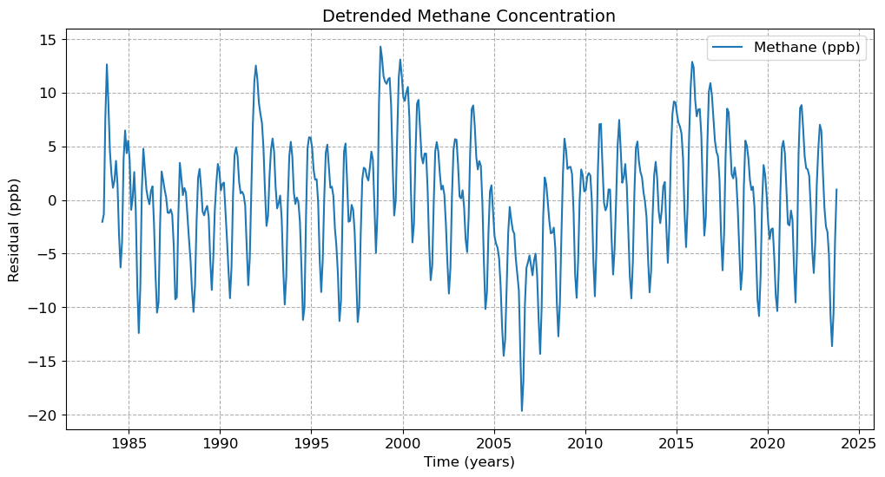
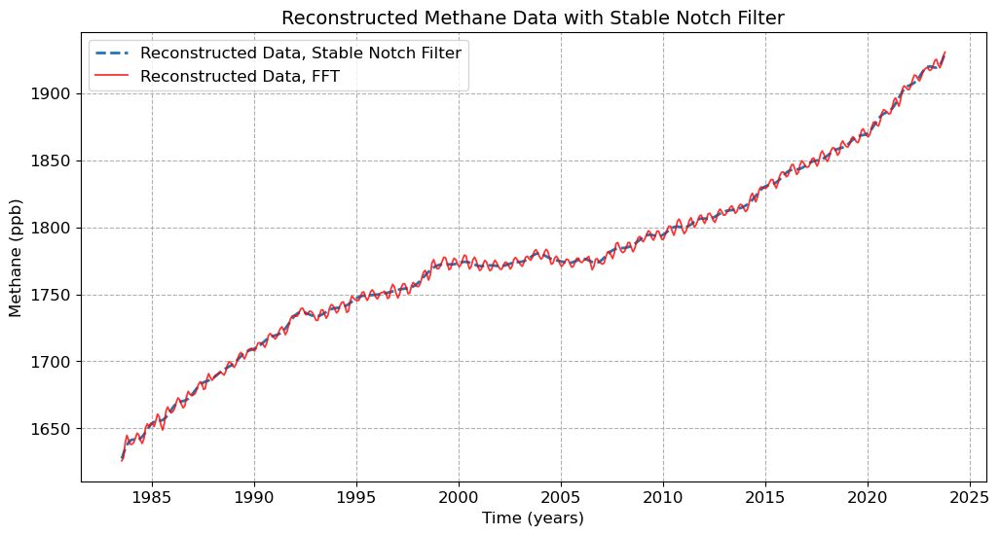
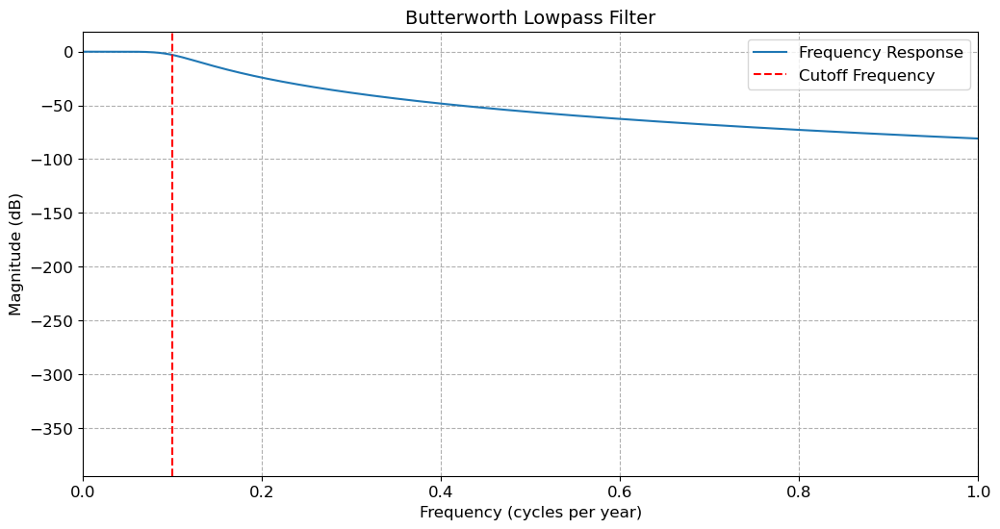
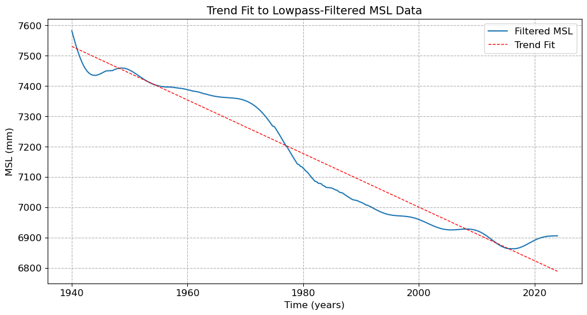

# Climate Signal Processing: Methane and Sea-Level Time Series

Signal-processing analysis of environmental time-series data using digital filter design, Fourier methods, and Butterworth filtering.

**[View the analysis notebook](notebook/Zhao_Rain_Yanzhi_Lab4_Code.ipynb)**  
**[Read the full project report](report/YOUR_REPORT_FILENAME.pdf)**

This project explores how frequency-domain and digital filtering techniques can be used to isolate periodic and long-term behaviour in real environmental datasets. The analysis focuses on globally averaged atmospheric methane concentrations and historical tide-gauge measurements from Churchill, Canada.

## Project Overview

Environmental time series often contain multiple overlapping components, including long-term trends, seasonal oscillations, measurement gaps, and higher-frequency variability.

This project applies several signal-processing approaches to separate these components and examine their behaviour:

1. **Digital notch-filter design and characterization**
2. **Removal of annual oscillations from atmospheric methane data**
3. **Low-pass filtering and trend estimation of Churchill tide-gauge data**

The project also compares Fourier-domain filtering with a designed rational notch filter and examines the importance of detrending before frequency-selective filtering.

## Methods

The analysis was performed in Python using NumPy, SciPy, and Matplotlib.

Methods include:

- Fast Fourier Transform (FFT)
- Inverse FFT reconstruction
- Rational digital filter design
- Pole-zero based notch filtering
- Impulse-response analysis
- Frequency-response analysis
- Polynomial detrending
- Butterworth low-pass filtering
- Zero-phase filtering
- Missing-data handling
- Linear trend estimation

Reusable digital-filter functions are provided separately in [`src/filters.py`](src/filters.py).

---

## Digital Notch-Filter Design

A rational digital filter was constructed to target a specified oscillation frequency.

The filter coefficients were derived from the locations of conjugate poles and zeros, with the parameter `epsilon` controlling their separation and therefore the width of the notch.

The filter was characterized using its impulse response and Fourier-domain frequency response before being applied to environmental data.

This provides a direct connection between the mathematical filter design and its effect on real time-series signals.

---

## Atmospheric Methane Analysis

### Detrending and Seasonal Variability

The globally averaged methane record contains both a long-term trend and shorter-timescale oscillations.

Before filtering, the long-term component was removed to better isolate the periodic behaviour. This reduces interference between the low-frequency trend and the targeted seasonal signal.

### Fourier Filtering

The detrended methane series was transformed into the frequency domain using an FFT. Selected frequency components associated with the annual oscillation were removed before reconstructing the signal with an inverse FFT.

### Notch Filtering

A rational notch filter was independently applied to target the annual oscillation.

The filtered residual was then combined with the previously removed long-term trend to reconstruct the methane time series.

### Comparing Fourier and Notch Filtering

The Fourier and notch-filter approaches provide two different strategies for removing periodic components.

Fourier filtering allows frequency components to be manipulated explicitly and performs well for evenly sampled data. However, boundary effects and spectral leakage can become important when the signal contains gaps or non-stationary behaviour.

The notch filter provides targeted frequency removal directly through a designed digital filter, but its performance depends more strongly on filter parameters and stability.

The analysis also demonstrates the importance of **detrending before filtering**. Applying both approaches directly to the original signal produced substantially larger distortions near the boundaries of the time series.

---

## Churchill Tide-Gauge Analysis

Historical tide-gauge measurements from Churchill, Canada were used to investigate longer-timescale sea-level variability.

The raw record contains missing observations represented by sentinel values. These measurements were identified and handled before filtering.

### Butterworth Low-Pass Filter

A **fourth-order Butterworth low-pass filter** was designed with a cutoff corresponding to approximately **0.1 cycles/year**.

The Butterworth design provides a maximally flat passband while suppressing higher-frequency variability, allowing variations with periods longer than approximately ten years to be emphasized.

The filtered signal was then compared with the original tide-gauge record.

### Long-Term Trend

A first-degree polynomial was fitted to the low-pass-filtered record to estimate the long-term rate of change over approximately 84 years of observations.

The analysis produced an approximate trend of:

**−8.85 mm/year**

within the analyzed Churchill record.

This value represents the linear trend obtained from this particular filtering and fitting procedure rather than a general estimate of global sea-level change.

## Data

### Atmospheric Methane

Globally averaged atmospheric methane measurements are used to investigate long-term and seasonal variability.

### Churchill Tide Gauge

Historical monthly tide-gauge measurements from Churchill, Canada are used for the long-timescale filtering analysis.

The original record contains missing observations, providing an additional real-world data-processing challenge.

## Tools and Libraries

- Python
- NumPy
- SciPy
- Matplotlib
- Jupyter Notebook

## Reproducibility

The datasets required by the analysis are included in the [`data/`](data/) directory.

Reusable filter-design functions are available in [`src/filters.py`](src/filters.py), while the complete analysis and visualizations are provided in the [`notebook/`](notebook/) directory.

## Key Takeaways

This project demonstrates:

- Implementation of digital filters from mathematical coefficients
- Frequency-domain analysis using FFT
- Comparison of Fourier and time-domain filtering
- Detrending and signal reconstruction
- Handling of missing real-world observations
- Butterworth low-pass filter design
- Extraction of long-timescale environmental signals
- Quantitative trend estimation from filtered time-series data

## Author

**Rain Zhao**

Physics / Astronomy  
Scientific Computing · Signal Processing · Time-Series Analysis
